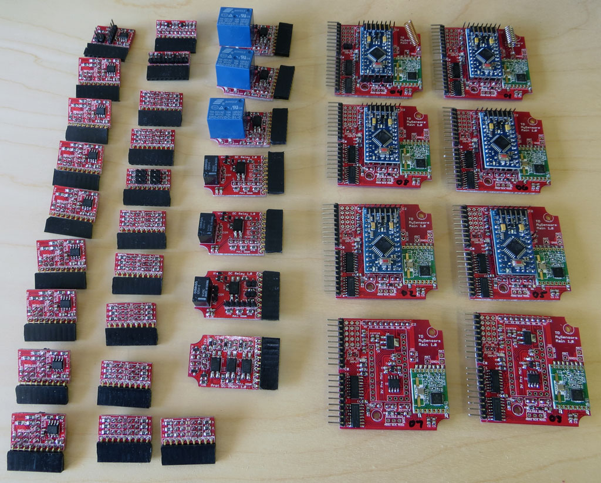
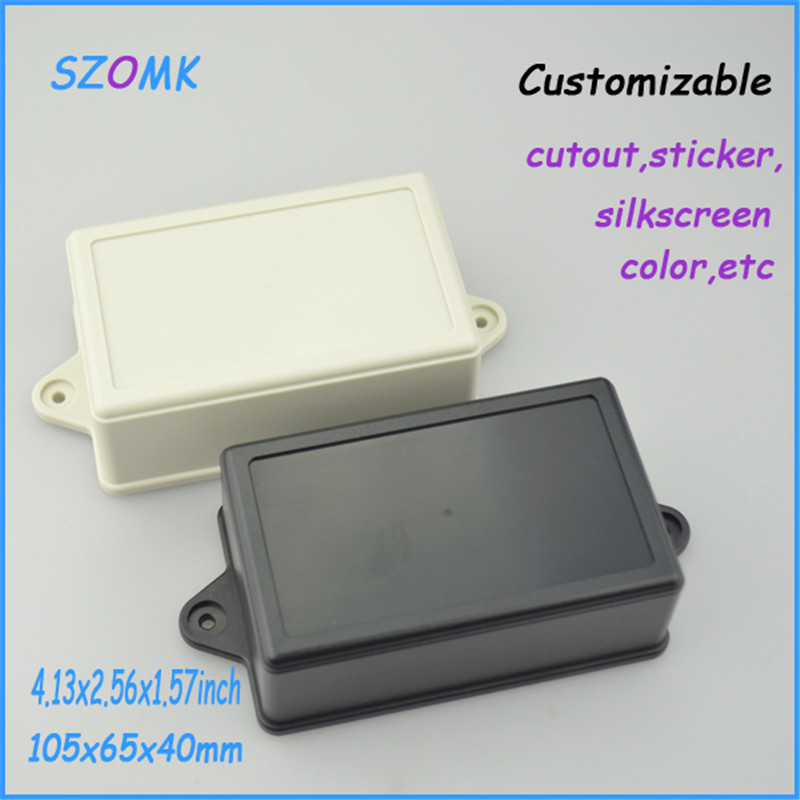

# MySensors Mother/Daughter board system

This repository contains the PCB design files, 3D renderings, and
software libraries to implement the
[MySensors](http:www.mysensors.org) mother/daughter board system
[described in this
thread](http://forum.mysensors.org/topic/2480/mother-daughter-board-system).

It's a mother/daughter board design using an RFM69 radio (though it
would be easy to change it to an NRF). I have about 10 sensors I need
to make and they're all similar, but not quite the same. This system
allows be to mix and match what I need for each application. It's
designed to be AC powered and uses a single case (see below) for all
of them (~$3/apiece for 10).

The main board has the basic components and supports two daughter
boards (roughly 25mm x 35mm) which plug into the side so the whole
assembly is basically flat (leaving more room in the case for the
switches, connectors, and LED's). An additional third daughter board
can be used for small boards mounted perpendicular to the main boards
(the sensor board below does that) or mounting over the top of the
arduino.

The main board contains:

- 3.3V Arduino Pro Mini
- RFM69 radio
   - side mount for external dipole antenna
   - interior mount with enough space for a helical antenna mounted
     parallel or perpendicular to the board
- 5V->3.3V power supply
- digital signing chip
- flash memory chip
- input and output shift registers
- headers for a switch, LED, and piezo buzzer
- header for SPI (MISO, MOSI, SCK) pins
- 2 side mounted daughter board headers with inputs and outputs from
  the shift registers
- 1 top mounted daughter board header with pins from the mini including
  D3 (IRQ), D5 and D6 (PWM), A3, A4 (SDA), and A5 (SCL)
- all components are top mounted for easier soldering and a bigger
  ground plane for better antenna performance

# Boards

Each daughter board header has 5V, 3.3V, ground, 3 input pins, and 3
output pins.  I've designed seven different daughter boards so far.   

- Valve/motor control board. I'm using this for articulated water
  valves for controlling leaks at the water heater, washing machine,
  etc.  It contains a L9110 motor controller, LED, and valve
  open/closed sensors.
- AC relay board. I'm using this to control simple AC load switching
  (in my case, a recirculation pump).  The board contains an
  opto-isolated AC relay with NO and NC terminals, 1 LED, and 2 sensor
  inputs with pull down resistors.
- DC relay board. I'm using this to control simple DC load switching
  (in my case, a triggering a garage door).  The board contains an
  opto-isolated DC relay with NO and NC terminals, 2 LED's, and 3 sensor
  inputs with pull down resistors.
- Protected input board. I'm using this to trigger when external
  security cameras and motion sensors trip (they both operate on 12V
  signals).  The board contains 3 opto-isolator circuits for
  triggering on 12V lines.
- Parking/RGB sensor board.  This board contains pins for an
  ultrasonic distance sensor and an RGB (neopixel) ring.  It includes
  5V/3.3V level shifting for the distance sensor.  This board must be
  connected to the 3'rd slot which interfaces directly with the
  Arduino pins because of the neopixel timing requirements.
- Sensor board.  3 sensor inputs with pull down resistors and 3 LED
  outputs with 1K resistors.  This is designed primarily for water
  leak detectors.  The rope leak sensor I'm using works better w/ 5V
  input and analog output so sensors can be fed with 5V or 3.3V and
  when connected in the 3'rd slot, they will output to the Arduino's
  analog pins.
- I2C board.  This is simple small board that adds multiple I2C pins.

Here's an image of the assembled boards:

# Ordering

The boards file contains the individual board designs (done in Eagle)
as well as panelized versions.  A single 10cm x 10cm panel contains 2
main boards, 1 each of the AC relay, DC relay, protected input,
parking board, and I2C board; 2 valve boards; and 3 sensor boards.  

# Project Case

The boards are designed to fit inside a specific case (size and
mounting holes) which can be [found
here](http://www.aliexpress.com/item/Wholesale-electrical-junction-box-10pcs-105-65-40mm-plastic-instrument-box-plastic-box-electronic-project-box/1986580384.html).
There are many options for ordering this case on AliExpress (various
quantities and vendors).  Searching for ["105\*65\*40mm"](http://www.aliexpress.com/af/105*65*40mm.html?ltype=wholesale&d=y&origin=n&isViewCP=y&catId=0&initiative_id=SB_20160206141640&SearchText=105*65*40mm) will
generally show them all.

# Software

The lib directory contains a class for each board.  Each child board
class is constructed by passing it a structure from the main board
class which defines which slot it's plugged in to.  The boards (mother
and children) all contain elements for manipulating their components
(LED's, relays, sensors, etc) which abstract away the method by which
their connected (call sensor.led[0].on() to turn on the 0'th LED of a
sensor board) which makes writing the final sketches which use the
boards very easy.

The software does depend on my [arduino-core library
classes](https://github.com/TD22057/TD-Arduino-Core).

# Licenses

All the software in this repository is covered by the GPL-V3 license
(see [LICENSE-software](LICENSE-software)).

All the hardare in this repository is covered by the CERN Open
Hardware Licence v1.2 (see [LICENSE-hardware](LICENSE-hardware)).

